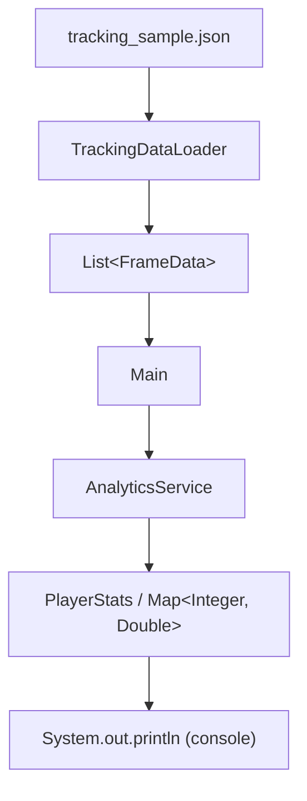
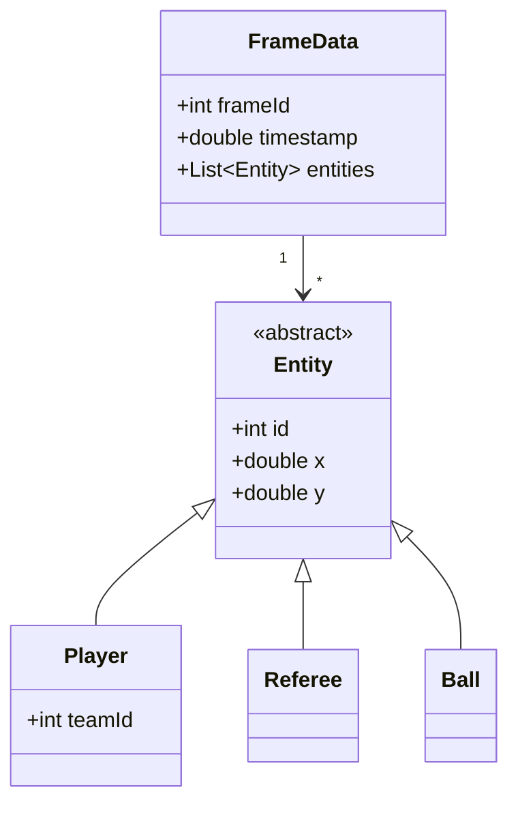

<div align="center">

# ⚽ TaticAnalytics Core

**Tracking data analysis engine for football (soccer) matches**


</div>

## Table of Contents

- [Overview](#overview)
- [Features](#features)
- [Architecture](#architecture)
- [Data Flow](#data-flow)
- [Domain Model](#domain-model)
- [Class Guide](#class-guide)
- [Core API](#core-api)
- [Input Data](#input-data)
- [Usage](#usage)
- [Running the Project](#running-the-project)
- [Tests](#tests)
- [Algorithms / Implementation Notes](#algorithms--implementation-notes)
- [Known Limitations](#known-limitations)
- [Project Structure](#project-structure)
- [Evolution into a Java Library](#evolution-into-a-java-library)
- [Contributing](#contributing)
- [Roadmap](#roadmap)

---

## Overview

**TaticAnalytics Core** is the Java backend responsible for turning raw tracking data extracted from football match videos into analytical game metrics.

The input data consists of `X, Y` coordinates of players, the referee, and the ball, typically generated by a computer-vision tracking pipeline. The role of this module is to process that data frame by frame and calculate spatial and temporal statistics such as distance covered, maximum speed, and ball possession.

The project currently runs as a console application (MVP). Its internal design separates domain modeling, data loading, and analytical logic, which makes it a reasonable candidate to evolve into a reusable Java library in the future.

---

## Features

### ✅ Implemented

- Loading of tracking data into the domain model via `TrackingDataLoader`.
- Calculation of **total distance covered** by a player.
- Calculation of **maximum speed** reached by a player.
- Calculation of **ball possession per team**, with protection against retroactive attribution and handling of occlusion/contested ball.
- Calculation of **ball possession per player**, using the same possession state machine.

### 📋 Planned

- Heatmap / grid-based spatial metrics.
- `GameStatus` filter (ball out of play / half-time).
- Report export (CSV/JSON).
- Packaging the core as a reusable `.jar` library, with possible integration via Spring Boot or JavaFX.

---

## Architecture

```text
Tracking JSON (tracking_sample.json)
            ↓
   TrackingDataLoader
            ↓
   Domain Model (FrameData, Entity, Player, Referee, Ball)
            ↓
   AnalyticsService (business rules)
            ↓
   PlayerStats / Possession maps
```

- **`model`** — domain entities representing the state of the field at a given moment.
- **`service`** — business rules (kinematic calculations, possession state machine) and data loading.
- **root (`Main`)** — entry point of the console application, orchestrating loading and printing of results.

`AnalyticsService` operates entirely on domain objects and has no dependency on how the tracking data was loaded.

---

## Data Flow



In plain terms: the tracking file is read by `TrackingDataLoader.loadData(...)`, which returns a list of `FrameData` objects already populated with domain entities (`Player`, `Referee`, `Ball`). `Main` passes this list to `AnalyticsService`, which runs the kinematic algorithms and the ball-possession state machine, producing the results that are currently printed to the console.

---

## Domain Model



- **`Entity`** *(abstract)* — base contract for any physical object on the field: an identifier (`id`) and coordinates (`x`, `y`).
- **`Player`** *(extends `Entity`)* — represents an athlete on the field; adds a `teamId` attribute associating the player with a team.
- **`Referee`** *(extends `Entity`)* — represents the match referee. Handled explicitly by `Main`.
- **`Ball`** *(extends `Entity`)* — represents the ball; used to identify ball-related entities during possession calculations.
- **`FrameData`** — represents the state of the field at a single instant `T`: a `frameId`, a `timestamp`, and the list of `Entity` objects present in that frame.
- **`PlayerStats`** — output object encapsulating the kinematic results calculated for a player, exposing `getTotalDistance()`, `getMaxSpeed()`, and `getMaxSpeedKmh()`.

---

## Class Guide

### `AnalyticsService`

**Package:** `com.taticanalytics.service`

**Responsibility:** the main analytical engine of the system. Calculates kinematic variables (distance, speed) and manages the state machine responsible for ball-possession attribution.

**Main methods:** `calculatePlayerStats(...)`, `calculatePossessionTimePerTeam(...)`, `calculatePossessionTimePerPlayer(...)`.

**Relationships:** consumes `List<FrameData>` produced by `TrackingDataLoader`; iterates over `Entity` and distinguishes `Player`, `Referee`, and `Ball`; consumed by `Main` and by `AnalyticsServiceTest`.

**Role in the architecture:** main candidate to become the public facade should the project evolve into a library.

### `TrackingDataLoader`

**Package:** `com.taticanalytics.service`

**Responsibility:** load tracking data from a file into the domain model.

**Main methods:** `loadData(String filePath)`.

**Relationships:** produces `List<FrameData>`; consumed by `Main`.

### `Entity` *(abstract)*

**Package:** `com.taticanalytics.model`

**Responsibility:** base contract guaranteeing that every physical object on the field has an identifier and coordinates.

**Relationships:** superclass of `Player`, `Referee`, and `Ball`; aggregated by `FrameData`.

### `Player` *(extends `Entity`)*

**Package:** `com.taticanalytics.model`

**Responsibility:** represents an athlete on the field; adds `teamId`.

**Relationships:** used by `AnalyticsService` in distance, speed, and possession calculations.

### `Referee` *(extends `Entity`)*

**Package:** `com.taticanalytics.model`

**Responsibility:** represents the match referee.

**Relationships:** handled explicitly by `Main`.

### `Ball` *(extends `Entity`)*

**Package:** `com.taticanalytics.model`

**Responsibility:** represents the ball on the field.

**Relationships:** used by `AnalyticsService` in the possession logic.

### `FrameData`

**Package:** `com.taticanalytics.model`

**Responsibility:** groups all objects on the field at a single instant `T`.

**Relationships:** contains `Entity` objects; consumed by `AnalyticsService` and produced by `TrackingDataLoader`.

### `PlayerStats`

**Package:** `com.taticanalytics.model`

**Responsibility:** output object encapsulating a player's kinematic results.

**Main methods:** `getTotalDistance()`, `getMaxSpeed()`, `getMaxSpeedKmh()`.

**Relationships:** produced by `AnalyticsService`; consumed by `Main`.

### `Main`

**Package:** `com.taticanalytics` (root)

**Responsibility:** entry point of the console application; orchestrates loading via `TrackingDataLoader` and processing via `AnalyticsService`, printing the results.

---

## Core API

### `AnalyticsService`

| Method | Returns | Description |
| --- | --- | --- |
| `calculatePlayerStats(List<FrameData> frames, int entityId)` | `PlayerStats` | Calculates total distance covered and maximum speed for the given entity across the provided frames. |
| `calculatePossessionTimePerTeam(List<FrameData> frames, double radiusMeters)` | `Map<Integer, Double>` | Calculates ball possession time (in seconds) per `teamId`. |
| `calculatePossessionTimePerPlayer(List<FrameData> frames, double radiusMeters)` | `Map<Integer, Double>` | Calculates ball possession time (in seconds) per `playerId`. |

### `PlayerStats`

| Method | Returns | Description |
| --- | --- | --- |
| `getTotalDistance()` | `double` | Total distance covered by the player. |
| `getMaxSpeed()` | `double` | Maximum speed reached by the player. |
| `getMaxSpeedKmh()` | `double` | Maximum speed reached by the player, expressed in km/h. |

### `TrackingDataLoader`

| Method | Returns | Description |
| --- | --- | --- |
| `loadData(String filePath)` | `List<FrameData>` | Loads tracking data from the given file path into the domain model. |

---

## Input Data

The project includes a sample tracking dataset at `src/main/resources/tracking_sample.json`, which is loaded through `TrackingDataLoader`.

The exact structure of the tracking file (field names, entity typing, etc.) is defined by this dataset and by `TrackingDataLoader`'s implementation. Refer to `tracking_sample.json` directly for the authoritative format.

---

## Usage

```java
TrackingDataLoader loader = new TrackingDataLoader();
List<FrameData> frames = loader.loadData("tracking_sample.json");

AnalyticsService analytics = new AnalyticsService();

// Kinematic statistics for a specific player
PlayerStats stats = analytics.calculatePlayerStats(frames, /* entityId */ 7);
double distance = stats.getTotalDistance();
double maxSpeedKmh = stats.getMaxSpeedKmh();

// Ball possession per team
Map<Integer, Double> possessionPerTeam =
    analytics.calculatePossessionTimePerTeam(frames, /* radiusMeters */ 2.0);

// Ball possession per player
Map<Integer, Double> possessionPerPlayer =
    analytics.calculatePossessionTimePerPlayer(frames, /* radiusMeters */ 2.0);
```

> The `radiusMeters` value above is illustrative; adjust it to match your desired possession-detection tolerance.

---

## Running the Project

**Prerequisites:**

- Java 17+
- Maven

**Build:**

```bash
mvn clean compile
```

**Run:**

```bash
mvn clean compile exec:java -Dexec.mainClass="com.taticanalytics.Main"
```

`Main` is the entry point of the console application: it loads the sample tracking data via `TrackingDataLoader` and runs the analytics via `AnalyticsService`, printing the results to the console.

---

## Tests

```bash
mvn test
```

`AnalyticsServiceTest` covers the ball-possession state machine (per team and per player), including protection against retroactive attribution, as well as the kinematic calculations (distance/speed).

---

## Algorithms / Implementation Notes

### Distance

The distance covered by an entity is calculated as the sum of the Euclidean distances between its positions in consecutive frames.

### Speed

```text
speed = distance / Δt
```

The maximum speed is updated whenever a higher instantaneous speed is found along the frame series, and is exposed both in its base unit (`getMaxSpeed()`) and in km/h (`getMaxSpeedKmh()`).

### Ball possession

For every frame, the system identifies which player is closest to the ball. If that minimum distance is within the given `radiusMeters`, that player (and their team) is considered the possessor of the ball at that instant.

### Temporal state (avoiding retroactive attribution)

Instead of crediting each time interval to whoever is closest to the ball *in the current frame*, the system keeps track of the current possessor and credits the elapsed time to that previous possessor before updating the state. This avoids retroactively crediting possession time to a player who only gained possession after the interval in question.

---

## Known Limitations

- Ball detection loss (occlusion) or a contested ball (distance to the ball exceeding `radiusMeters`) results in that time interval not being credited to any player or team.
- Heatmap/grid-based spatial metrics and the `GameStatus` filter are not yet implemented.
- The project currently runs as a console application; it has not yet been packaged as a standalone library.

---

## Project Structure

```text
taticanalytics-core/
├── pom.xml
└── src/
    ├── main/
    │   ├── java/
    │   │   └── com/
    │   │       └── taticanalytics/
    │   │           ├── Main.java
    │   │           ├── model/
    │   │           │   ├── Ball.java
    │   │           │   ├── Entity.java
    │   │           │   ├── FrameData.java
    │   │           │   ├── Player.java
    │   │           │   ├── PlayerStats.java
    │   │           │   └── Referee.java
    │   │           └── service/
    │   │               ├── AnalyticsService.java
    │   │               └── TrackingDataLoader.java
    │   └── resources/
    │       └── tracking_sample.json
    └── test/
        └── java/
            └── com/
                └── taticanalytics/
                    └── AnalyticsServiceTest.java
```

---

## Evolution into a Java Library

`TaticAnalytics Core` is structured so that its evolution into a reusable library is architecturally viable, even though that separation is not implemented as a distinct module today.

```text
        Consuming applications (future)
        ┌───────────────┬───────────────┐
        │  Spring Boot   │    JavaFX     │
        └───────┬───────┴───────┬───────┘
                │  Analytics API │
                └────────┬───────┘
                          │
                TaticAnalytics Core
        (model + service — domain and business rules)
```

**Why this separation is viable:**

- `AnalyticsService` depends only on domain objects (`FrameData`, `Entity`, `Player`, `Referee`, `Ball`) — it has no knowledge of how the data was loaded.
- This decoupling would, in theory, allow feeding `AnalyticsService` with data from other sources in the future (WebSocket, REST API, database), without changing its internal logic.

**Main candidates in an eventual split:**

- **Library core (public):** `AnalyticsService` as the main facade; `model.*` as the exposed domain types.
- **Internal components (non-public):** `Main` and `TrackingDataLoader` would move to a samples/loading module, not part of the public analytics API.

---

## Contributing

Suggested path for anyone contributing to the project:

1. **Start with the models** (`com.taticanalytics.model`) — understand the `Entity` inheritance and the composition of `FrameData`.
2. **Read `AnalyticsService`** — the heart of the business logic. Pay special attention to the possession state machine and how it avoids retroactive attribution.
3. **Understand data loading** in `TrackingDataLoader` — see how the tracking file becomes a `List<FrameData>`.
4. **Run `Main`** to see the full end-to-end flow.
5. **Read `AnalyticsServiceTest`** to understand the possession edge cases (occlusion, contested ball, retroactive bias).

To run the tests locally:

```bash
mvn test
```

---

## Roadmap

- [ ] Implement heatmap / grid-based spatial metrics.
- [ ] Implement `GameStatus` filter (ball out of play / half-time).
- [ ] Export reports in CSV/JSON.
- [ ] Package the core as a reusable `.jar` library.
- [ ] Evaluate integration with Spring Boot and/or JavaFX as application layers on top of the core.