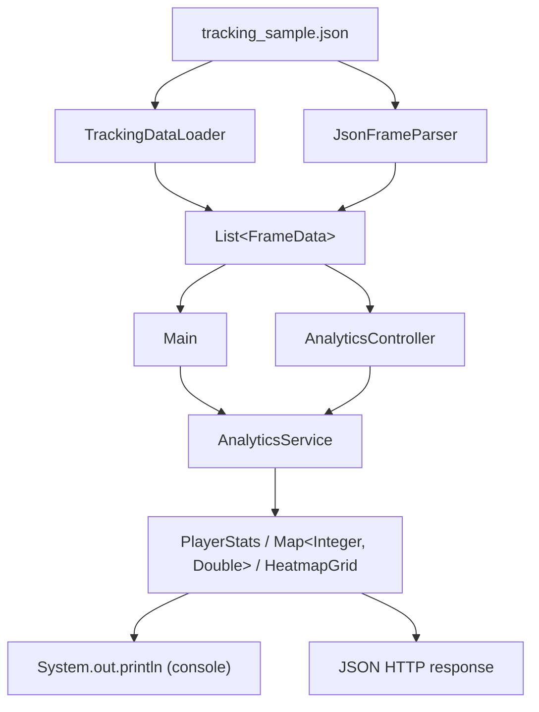
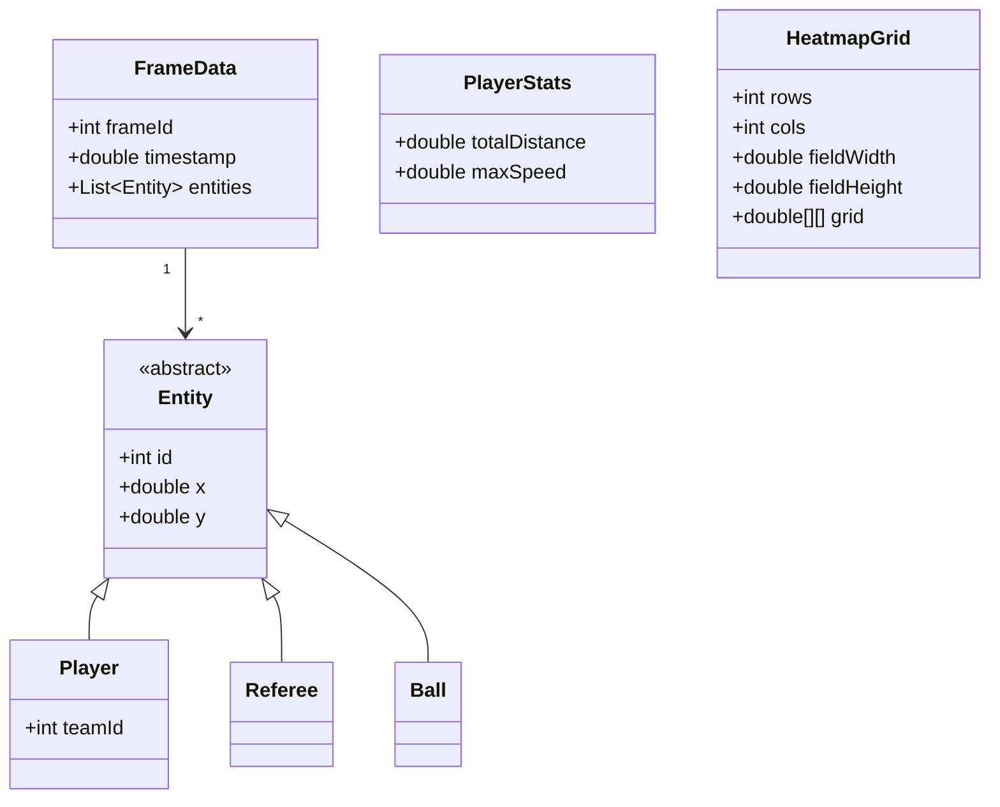

<div align="center">

# ⚽ TaticAnalytics Core

**Tracking data analysis engine for football (soccer) matches**


</div>

## Table of Contents

- [Overview](#overview)
- [Features](#features)
- [Architecture](#architecture)
- [Data Flow](#data-flow)
- [Domain Model](#domain-model)
- [Class Guide](#class-guide)
- [Core API (Java)](#core-api-java)
- [REST API](#rest-api)
- [Input Data](#input-data)
- [Usage](#usage)
- [Running the Project](#running-the-project)
- [Tests](#tests)
- [Algorithms / Implementation Notes](#algorithms--implementation-notes)
- [Known Issues / To Review & Resolve](#known-issues--to-review--resolve)
- [Project Structure](#project-structure)
- [Evolution into a Java Library](#evolution-into-a-java-library)
- [Contributing](#contributing)
- [Roadmap](#roadmap)

---

## Overview

**TaticAnalytics Core** is the Java backend responsible for turning raw tracking data extracted from football match videos into analytical game metrics.

The input data consists of `X, Y` coordinates of players, the referee, and the ball, typically generated by a computer-vision tracking pipeline. The role of this module is to process that data frame by frame and calculate spatial and temporal statistics such as distance covered, maximum speed, ball possession, and spatial heatmaps.

The project has two entry points today:

- A **standalone console application** (`Main`), the original MVP, used for quick verification and batch inspection of tracking data.
- A **Spring Boot REST API** (`Application`), which exposes the same analytics engine (`AnalyticsService`) over HTTP endpoints.

Its internal design separates domain modeling, data loading/parsing, and analytical logic, which makes it a reasonable candidate to evolve into a reusable Java library in the future — and, eventually, to be fed directly by a computer-vision tracking pipeline instead of a static sample file.

---

## Features

### ✅ Implemented

- Loading of tracking data into the domain model, via two parallel paths: `TrackingDataLoader` (tree-based JSON parsing, used by the console app) and `JsonFrameParser` (DTO-based parsing, used by the REST API).
- Calculation of **total distance covered** by a player.
- Calculation of **maximum speed** reached by a player.
- Calculation of **ball possession per team**, with protection against retroactive attribution and handling of occlusion/contested ball.
- Calculation of **ball possession per player**, using the same possession state machine.
- **Spatial heatmap generation** per player (`HeatmapGrid`), with configurable grid resolution and field dimensions.
- A **Spring Boot REST API** (`AnalyticsController`) exposing player stats, possession (per player/team), and heatmap endpoints.
- **Global exception handling** (`GlobalExceptionHandler`) returning standardized JSON error responses instead of raw stack traces.
- **CORS configuration** (`WebConfig`) allowing cross-origin requests to the API.
- An **export service** (`ExportService`) able to write results to JSON and CSV files — implemented but not yet wired into the API or the console app.

### 📋 Planned

See [Roadmap](#roadmap).

---

## Architecture

```text
                    Tracking JSON (tracking_sample.json)
                                 │
                 ┌───────────────┴───────────────┐
                 ▼                                ▼
        TrackingDataLoader                 JsonFrameParser
        (tree-based, console)          (DTO-based, REST API)
                 │                                │
                 └───────────────┬───────────────┘
                                 ▼
                Domain Model (FrameData, Entity, Player, Referee, Ball)
                                 │
                                 ▼
                  AnalyticsService (business rules)
                                 │
                 ┌───────────────┼───────────────┐
                 ▼               ▼               ▼
          PlayerStats     Possession maps   HeatmapGrid
                 │               │               │
                 ▼               ▼               ▼
        Main (console print)          AnalyticsController (JSON over HTTP)
```

- **`model`** — domain entities representing the state of the field at a given moment, plus output objects (`PlayerStats`, `HeatmapGrid`).
- **`service`** — business rules (kinematic calculations, possession state machine, heatmap generation) and the console-oriented data loader.
- **`io`** — the DTO-based JSON parser used by the REST API (`JsonFrameParser`, `io.dto.*`) and the export service (`ExportService`).
- **`controller`** — the REST API surface (`AnalyticsController`).
- **`config`** — Spring web configuration (`WebConfig`, CORS).
- **`exception`** — centralized error handling (`GlobalExceptionHandler`).
- **`util`** — shared constants (`MatchConstants`).
- **root (`Main`, `Application`)** — the two entry points: console app and Spring Boot web app.

`AnalyticsService` operates entirely on domain objects and has no dependency on how the tracking data was loaded — this is what allows two different loaders (`TrackingDataLoader` and `JsonFrameParser`) to coexist today.

---

## Data Flow



In plain terms: the tracking file is read either by `TrackingDataLoader.loadData(...)` (console path) or `JsonFrameParser` (REST API path, currently always reading the same sample file via `loadSampleData()`), both producing a list of `FrameData` objects populated with domain entities (`Player`, `Referee`, `Ball`). From there, `Main` or `AnalyticsController` passes this list to `AnalyticsService`, which runs the kinematic algorithms, the ball-possession state machine, and heatmap generation, producing results that are either printed to the console or serialized to JSON and returned over HTTP.

---

## Domain Model



- **`Entity`** *(abstract)* — base contract for any physical object on the field: an identifier (`id`) and coordinates (`x`, `y`).
- **`Player`** *(extends `Entity`)* — represents an athlete on the field; adds a `teamId` attribute associating the player with a team.
- **`Referee`** *(extends `Entity`)* — represents the match referee. Handled explicitly by `Main`.
- **`Ball`** *(extends `Entity`)* — represents the ball; used to identify ball-related entities during possession calculations.
- **`FrameData`** — represents the state of the field at a single instant `T`: a `frameId`, a `timestamp`, and the list of `Entity` objects present in that frame.
- **`PlayerStats`** — output object encapsulating the kinematic results calculated for a player, exposing `getTotalDistance()`, `getMaxSpeed()`, and `getMaxSpeedKmh()`.
- **`HeatmapGrid`** — output object encapsulating a spatial grid of accumulated time-on-cell values for a player, exposing `getGrid()`, `getRows()`, and `getCols()`.

---

## Class Guide

### `AnalyticsService`

**Package:** `com.taticanalytics.service`

**Responsibility:** the main analytical engine of the system. Calculates kinematic variables (distance, speed), manages the state machine responsible for ball-possession attribution, and generates spatial heatmaps. Stateless (safe as a Spring singleton).

**Main methods:** `calculatePlayerStats(...)`, `calculatePossessionTimePerTeam(...)`, `calculatePossessionTimePerPlayer(...)`, `generatePlayerHeatmap(...)`.

**Relationships:** consumes `List<FrameData>` produced by either `TrackingDataLoader` or `JsonFrameParser`; iterates over `Entity` and distinguishes `Player`, `Referee`, and `Ball`; consumed by `Main` and `AnalyticsController`.

**Role in the architecture:** main candidate to become the public facade should the project evolve into a library.

### `TrackingDataLoader`

**Package:** `com.taticanalytics.service`

**Responsibility:** loads tracking data from a file into the domain model by walking the raw JSON tree (`JsonNode`). Used exclusively by the console app.

**Main methods:** `loadData(String filePath)`, `loadSampleData()`.

**Relationships:** produces `List<FrameData>`; consumed by `Main`.

### `JsonFrameParser`

**Package:** `com.taticanalytics.io`

**Responsibility:** loads tracking data via Jackson DTO deserialization (`EntityDTO`, `FrameDataDTO`) and maps it into the domain model. Used exclusively by the REST API. A Spring `@Component`.

**Main methods:** `parseJsonString(String jsonContent)`, `loadSampleData()`.

**Relationships:** produces `List<FrameData>`; consumed by `AnalyticsController`.

### `EntityDTO` / `FrameDataDTO`

**Package:** `com.taticanalytics.io.dto`

**Responsibility:** "dumb" Java `record`s that mirror the raw JSON shape, used as an intermediate deserialization target before being mapped into the "smart" domain model by `JsonFrameParser`.

### `ExportService`

**Package:** `com.taticanalytics.io`

**Responsibility:** exports arbitrary data (stats, heatmaps) to JSON and CSV files on disk. Not currently a Spring bean and not called from anywhere — implemented ahead of the API/CLI wiring that will use it.

**Main methods:** `exportToJson(T data, String filePath)`, `exportPlayerStatsToCsv(...)`, `exportHeatmapToCsv(...)`.

### `AnalyticsController`

**Package:** `com.taticanalytics.controller`

**Responsibility:** exposes `AnalyticsService`'s capabilities as a REST API under `/api/v1/analytics`. See [REST API](#rest-api) for the endpoint list.

**Relationships:** depends on `AnalyticsService` and `JsonFrameParser` via constructor injection.

### `WebConfig`

**Package:** `com.taticanalytics.config`

**Responsibility:** configures CORS for the `/api/**` routes, currently allowing all origins.

### `GlobalExceptionHandler`

**Package:** `com.taticanalytics.exception`

**Responsibility:** intercepts exceptions thrown by any `@RestController` and converts them into standardized JSON error responses (400 for bad parameters/business-rule violations, 500 as a generic catch-all).

### `Entity` *(abstract)*

**Package:** `com.taticanalytics.model`

**Responsibility:** base contract guaranteeing that every physical object on the field has an identifier and coordinates.

**Relationships:** superclass of `Player`, `Referee`, and `Ball`; aggregated by `FrameData`.

### `Player` *(extends `Entity`)*

**Package:** `com.taticanalytics.model`

**Responsibility:** represents an athlete on the field; adds `teamId`.

**Relationships:** used by `AnalyticsService` in distance, speed, and possession calculations.

### `Referee` *(extends `Entity`)*

**Package:** `com.taticanalytics.model`

**Responsibility:** represents the match referee.

**Relationships:** handled explicitly by `Main`.

### `Ball` *(extends `Entity`)*

**Package:** `com.taticanalytics.model`

**Responsibility:** represents the ball on the field.

**Relationships:** used by `AnalyticsService` in the possession logic.

### `FrameData`

**Package:** `com.taticanalytics.model`

**Responsibility:** groups all objects on the field at a single instant `T`.

**Relationships:** contains `Entity` objects; consumed by `AnalyticsService` and produced by `TrackingDataLoader` / `JsonFrameParser`.

### `PlayerStats`

**Package:** `com.taticanalytics.model`

**Responsibility:** output object encapsulating a player's kinematic results.

**Main methods:** `getTotalDistance()`, `getMaxSpeed()`, `getMaxSpeedKmh()`.

**Relationships:** produced by `AnalyticsService`; consumed by `Main` and `AnalyticsController`.

### `HeatmapGrid`

**Package:** `com.taticanalytics.model`

**Responsibility:** output object encapsulating a spatial grid of accumulated time per cell for a player.

**Main methods:** `addTime(double x, double y, double deltaTime)`, `getGrid()`, `getRows()`, `getCols()`.

**Relationships:** produced by `AnalyticsService`; consumed by `Main` and `AnalyticsController`.

### `MatchConstants`

**Package:** `com.taticanalytics.util`

**Responsibility:** central holder for fixed configuration values (field dimensions, possession radius, default heatmap grid resolution), avoiding magic numbers scattered through the business logic.

### `Main`

**Package:** `com.taticanalytics` (root)

**Responsibility:** entry point of the console application; orchestrates loading via `TrackingDataLoader` and processing via `AnalyticsService`, printing the results (raw frames, kinematic stats, possession, heatmap).

### `Application`

**Package:** `com.taticanalytics` (root)

**Responsibility:** entry point of the Spring Boot web application; bootstraps the embedded server and the whole `@RestController` / `@Service` / `@Component` ecosystem.

---

## Core API (Java)

### `AnalyticsService`

| Method | Returns | Description |
| --- | --- | --- |
| `calculatePlayerStats(List<FrameData> frames, int entityId)` | `PlayerStats` | Calculates total distance covered and maximum speed for the given entity across the provided frames. |
| `calculatePossessionTimePerTeam(List<FrameData> frames, double radiusMeters)` | `Map<Integer, Double>` | Calculates ball possession time (in seconds) per `teamId`. |
| `calculatePossessionTimePerPlayer(List<FrameData> frames, double radiusMeters)` | `Map<Integer, Double>` | Calculates ball possession time (in seconds) per `playerId`. |
| `generatePlayerHeatmap(List<FrameData> frames, int entityId, int rows, int cols, double fieldWidth, double fieldHeight)` | `HeatmapGrid` | Generates a spatial time-on-cell heatmap for the given entity, with custom grid resolution and field dimensions. |

Overloaded variants of `calculatePossessionTimePerTeam`, `calculatePossessionTimePerPlayer`, and `generatePlayerHeatmap` exist that fall back to `MatchConstants` defaults.

### `PlayerStats`

| Method | Returns | Description |
| --- | --- | --- |
| `getTotalDistance()` | `double` | Total distance covered by the player. |
| `getMaxSpeed()` | `double` | Maximum speed reached by the player. |
| `getMaxSpeedKmh()` | `double` | Maximum speed reached by the player, expressed in km/h. |

### `HeatmapGrid`

| Method | Returns | Description |
| --- | --- | --- |
| `getGrid()` | `double[][]` | The accumulated time-per-cell matrix. |
| `getRows()` | `int` | Number of grid rows. |
| `getCols()` | `int` | Number of grid columns. |

### `TrackingDataLoader`

| Method | Returns | Description |
| --- | --- | --- |
| `loadData(String filePath)` | `List<FrameData>` | Loads tracking data from the given file path into the domain model. |
| `loadSampleData()` | `List<FrameData>` | Convenience overload that loads `tracking_sample.json`. |

### `JsonFrameParser`

| Method | Returns | Description |
| --- | --- | --- |
| `parseJsonString(String jsonContent)` | `List<FrameData>` | Deserializes a JSON string into DTOs, then maps it into the domain model. |
| `loadSampleData()` | `List<FrameData>` | Convenience overload that loads and parses `tracking_sample.json`. |

---

## REST API

Base path: `/api/v1/analytics`. All endpoints currently operate on the sample dataset (`tracking_sample.json`) loaded via `JsonFrameParser.loadSampleData()` — there is no way yet to submit a different match/tracking file through the API.

| Method | Path | Query Params | Description |
| --- | --- | --- | --- |
| `GET` | `/player/{id}/stats` | — | Returns `PlayerStats` (distance, max speed) for the given entity `id`. |
| `GET` | `/possession/players` | `radius` *(optional)* | Returns possession time per player (`Map<Integer, Double>`). Falls back to `MatchConstants.BALL_CONTROL_RADIUS` if `radius` is omitted. |
| `GET` | `/possession/teams` | `radius` *(optional)* | Returns possession time per team (`Map<Integer, Double>`). Same fallback behavior. |
| `GET` | `/player/{id}/heatmap` | `rows`, `cols`, `fieldWidth`, `fieldHeight` *(all optional)* | Returns a `HeatmapGrid` for the given entity `id`. Falls back to `MatchConstants` defaults for any omitted parameter. |

Errors are returned as standardized JSON via `GlobalExceptionHandler`:

- `400 Bad Request` — invalid parameter type (e.g. non-numeric `id`) or a thrown `IllegalArgumentException`.
- `500 Internal Server Error` — any other unexpected exception (generic message only, no stack trace leaked to the client).

CORS is open to all origins (`WebConfig`), so any front-end can call this API during development.

---

## Input Data

The project includes a sample tracking dataset at `src/main/resources/tracking_sample.json`, which is loaded through either `TrackingDataLoader` (console) or `JsonFrameParser` (REST API).

The exact structure of the tracking file (field names, entity typing, etc.) is defined by this dataset and by the loader/DTO implementations. Refer to `tracking_sample.json`, `EntityDTO`, and `FrameDataDTO` directly for the authoritative format.

---

## Usage

### Java (embedding the core directly)

```java
TrackingDataLoader loader = new TrackingDataLoader();
List<FrameData> frames = loader.loadData("tracking_sample.json");

AnalyticsService analytics = new AnalyticsService();

// Kinematic statistics for a specific player
PlayerStats stats = analytics.calculatePlayerStats(frames, /* entityId */ 7);
double distance = stats.getTotalDistance();
double maxSpeedKmh = stats.getMaxSpeedKmh();

// Ball possession per team
Map<Integer, Double> possessionPerTeam =
    analytics.calculatePossessionTimePerTeam(frames, /* radiusMeters */ 2.0);

// Ball possession per player
Map<Integer, Double> possessionPerPlayer =
    analytics.calculatePossessionTimePerPlayer(frames, /* radiusMeters */ 2.0);

// Spatial heatmap for a player
HeatmapGrid heatmap = analytics.generatePlayerHeatmap(frames, /* entityId */ 7);
```

> The `radiusMeters` value above is illustrative; adjust it to match your desired possession-detection tolerance.

### REST API (via HTTP)

```bash
curl http://localhost:8080/api/v1/analytics/player/7/stats
curl http://localhost:8080/api/v1/analytics/possession/players?radius=2.0
curl http://localhost:8080/api/v1/analytics/possession/teams
curl "http://localhost:8080/api/v1/analytics/player/7/heatmap?rows=10&cols=15"
```

---

## Running the Project

**Prerequisites:**

- Java 17+
- Maven

**Build:**

```bash
mvn clean compile
```

**Run the console app:**

```bash
mvn clean compile exec:java -Dexec.mainClass="com.taticanalytics.Main"
```

`Main` loads the sample tracking data via `TrackingDataLoader` and runs the analytics via `AnalyticsService`, printing the results to the console.

**Run the REST API:**

```bash
mvn spring-boot:run
```

This starts the embedded Tomcat server (default port `8080`) and exposes the endpoints documented in [REST API](#rest-api).

---

## Tests

```bash
mvn test
```

- `AnalyticsServiceTest` — covers the ball-possession state machine (per team and per player), including protection against retroactive attribution, as well as the kinematic calculations (distance/speed).
- `AnalyticsServiceHeatmapTest` — covers heatmap cell accumulation, frame-gap handling, non-existent players, and default-dimension fallbacks.
- `JsonFrameParserTest` — covers DTO-based JSON parsing into the domain model.

---

## Algorithms / Implementation Notes

### Distance

The distance covered by an entity is calculated as the sum of the Euclidean distances between its positions in consecutive frames.

### Speed

```text
speed = distance / Δt
```

The maximum speed is updated whenever a higher instantaneous speed is found along the frame series, and is exposed both in its base unit (`getMaxSpeed()`) and in km/h (`getMaxSpeedKmh()`).

### Ball possession

For every frame, the system identifies which player is closest to the ball. If that minimum distance is within the given `radiusMeters`, that player (and their team) is considered the possessor of the ball at that instant.

### Temporal state (avoiding retroactive attribution)

Instead of crediting each time interval to whoever is closest to the ball *in the current frame*, the system keeps track of the current possessor and credits the elapsed time to that previous possessor before updating the state. This avoids retroactively crediting possession time to a player who only gained possession after the interval in question.

### Heatmap

The pitch is divided into a `rows × cols` grid. For each pair of consecutive frames in which the target entity appears, the elapsed time (`Δt`) is credited to the grid cell the entity occupied *during* that interval (i.e. its position in the earlier of the two frames), based on its `(x, y)` coordinates and the configured field dimensions.

### Frame continuity rule

All three algorithms above (distance/speed, possession, heatmap) only compute a value across two frames when `frame.getFrameId() - previousFrameId == 1`. This avoids treating a gap in tracking (occlusion, dropped frames) as a real, possibly enormous, movement.

---

## Known Issues / To Review & Resolve

This section tracks known gaps and risks identified during an internal code review, to be revisited once the computer-vision tracking pipeline is integrated.

### Independent of the computer-vision pipeline (safe to fix anytime)

- `TrackingDataLoader.loadData` silently swallows `IOException` (`e.printStackTrace()` + returns an empty list). Callers cannot distinguish "an empty match" from "the file failed to load."
- `GlobalExceptionHandler`'s catch-all handler (`Exception.class`) never logs the underlying exception server-side — an unexpected error in production would leave no trace to debug from.
- `AnalyticsController` does not validate `rows`, `cols`, or `radius` query parameters. Invalid values (e.g. negative `rows`) fall into the generic 500 handler instead of a proper `400 Bad Request`.
- `ExportService` is implemented but not wired into either the REST API or the console app (no `@Component`/`@Service` annotation, no caller).
- File paths (`"src/main/resources/tracking_sample.json"`, hardcoded in `Main` and in both loaders' `loadSampleData()`) are relative to the working directory. This breaks once the app is packaged and run as a standalone `.jar` from a different directory; loading via classpath (`getResourceAsStream`) would be more robust.
- Minor cosmetic cleanup: duplicate import in `JsonFrameParserTest`, unused `MatchConstants` import in `AnalyticsServiceTest`.

### Dependent on the computer-vision pipeline (revisit after integration)

- **Duplicate parsing logic**: `TrackingDataLoader` (tree-based, console) and `JsonFrameParser` (DTO-based, REST API) implement the same JSON-to-domain-model mapping independently, and already behave differently on unknown entity types (one logs, the other silently ignores). Once the real data contract from the CV pipeline is defined, these should likely be unified into a single loader.
- **API bound to the sample file**: every `AnalyticsController` endpoint always loads `tracking_sample.json` — there is no mechanism yet to submit or select a real match's tracking data. This needs to be designed once it's clear how the CV pipeline will deliver data (batch file, stream, upload endpoint, shared storage, etc.).
- **Frame-continuity assumption vs. real tracking gaps**: distance, possession, and heatmap calculations all skip any interval where `frameId` isn't perfectly consecutive. If the CV pipeline drops or de-duplicates low-confidence frames at a different rate than expected, this could silently under-report a large share of the metrics. Worth validating against real CV output before trusting the numbers.
- **Encapsulation leaks** (`FrameData.getEntities()`, `HeatmapGrid.getGrid()` return live mutable references) — acceptable for an MVP fed by a static sample file, but worth revisiting if the domain model starts being shared across concurrent requests/streams from a live pipeline.
- **CORS fully open** (`allowedOrigins("*")`) — fine for local development against a CV prototype, but should be scoped down once there's a real front-end/consumer.

---

## Project Structure

```text
taticanalytics-core/
├── pom.xml
└── src/
    ├── main/
    │   ├── java/
    │   │   └── com/
    │   │       └── taticanalytics/
    │   │           ├── Application.java
    │   │           ├── Main.java
    │   │           ├── config/
    │   │           │   └── WebConfig.java
    │   │           ├── controller/
    │   │           │   └── AnalyticsController.java
    │   │           ├── exception/
    │   │           │   └── GlobalExceptionHandler.java
    │   │           ├── io/
    │   │           │   ├── ExportService.java
    │   │           │   ├── JsonFrameParser.java
    │   │           │   └── dto/
    │   │           │       ├── EntityDTO.java
    │   │           │       └── FrameDataDTO.java
    │   │           ├── model/
    │   │           │   ├── Ball.java
    │   │           │   ├── Entity.java
    │   │           │   ├── FrameData.java
    │   │           │   ├── HeatmapGrid.java
    │   │           │   ├── Player.java
    │   │           │   ├── PlayerStats.java
    │   │           │   └── Referee.java
    │   │           ├── service/
    │   │           │   ├── AnalyticsService.java
    │   │           │   └── TrackingDataLoader.java
    │   │           └── util/
    │   │               └── MatchConstants.java
    │   └── resources/
    │       └── tracking_sample.json
    └── test/
        └── java/
            └── com/
                └── taticanalytics/
                    ├── io/
                    │   └── JsonFrameParserTest.java
                    └── service/
                        ├── AnalyticsServiceHeatmapTest.java
                        └── AnalyticsServiceTest.java
```

---

## Evolution into a Java Library

`TaticAnalytics Core` is structured so that its evolution into a reusable library is architecturally viable, even though that separation is not implemented as a distinct module today.

```text
        Consuming applications (present & future)
        ┌───────────────┬───────────────┬───────────────┐
        │  Spring Boot   │    JavaFX     │  CV Pipeline   │
        │  (this REST    │   (future)    │  (future data  │
        │   API today)   │               │   source)      │
        └───────┬───────┴───────┬───────┴───────┬───────┘
                │  Analytics API │
                └────────┬───────┘
                          │
                TaticAnalytics Core
        (model + service — domain and business rules)
```

**Why this separation is viable:**

- `AnalyticsService` depends only on domain objects (`FrameData`, `Entity`, `Player`, `Referee`, `Ball`) — it has no knowledge of how the data was loaded.
- This decoupling already allows two different loaders (`TrackingDataLoader`, `JsonFrameParser`) to feed the same engine, and would, in theory, allow feeding `AnalyticsService` with data from other sources in the future (WebSocket, REST API, database, or directly from a computer-vision pipeline), without changing its internal logic.

**Main candidates in an eventual split:**

- **Library core (public):** `AnalyticsService` as the main facade; `model.*` as the exposed domain types.
- **Internal components (non-public):** `Main`, `Application`, `TrackingDataLoader`, and `JsonFrameParser` would move to samples/adapter modules, not part of the public analytics API.

---

## Contributing

Suggested path for anyone contributing to the project:

1. **Start with the models** (`com.taticanalytics.model`) — understand the `Entity` inheritance, the composition of `FrameData`, and the `HeatmapGrid` structure.
2. **Read `AnalyticsService`** — the heart of the business logic. Pay special attention to the possession state machine, how it avoids retroactive attribution, and the frame-continuity rule shared by distance/possession/heatmap calculations.
3. **Understand data loading** in `TrackingDataLoader` (console path) and `JsonFrameParser` (REST API path) — see how the tracking file becomes a `List<FrameData>`, and note that these two loaders currently duplicate logic (see [Known Issues](#known-issues--to-review--resolve)).
4. **Read `AnalyticsController`** to see how the same engine is exposed over HTTP, and `GlobalExceptionHandler` to see how errors are standardized.
5. **Run `Main`** to see the console end-to-end flow, and `mvn spring-boot:run` to see the REST API end-to-end flow.
6. **Read the test suites** (`AnalyticsServiceTest`, `AnalyticsServiceHeatmapTest`, `JsonFrameParserTest`) to understand the covered edge cases (occlusion, contested ball, retroactive bias, frame gaps, non-existent players/entities).

To run the tests locally:

```bash
mvn test
```

---

## Roadmap

### ✅ Done

- [x] Kinematic calculations (distance, max speed).
- [x] Ball possession per team and per player, with retroactive-attribution protection.
- [x] Heatmap / grid-based spatial metrics.
- [x] Spring Boot REST API exposing the analytics engine.
- [x] Global exception handling with standardized JSON error responses.
- [x] CORS configuration for cross-origin API access.

### 📋 Planned

- [ ] `GameStatus` filter (ball out of play / half-time).
- [ ] Wire `ExportService` into the API and/or console app (report export in CSV/JSON).
- [ ] Unify `TrackingDataLoader` and `JsonFrameParser` into a single loader, once the computer-vision pipeline's data contract is defined.
- [ ] Allow the REST API to process real match/tracking data instead of only the fixed sample file.
- [ ] Add request-parameter validation (`rows`, `cols`, `radius`) with proper `400` responses.
- [ ] Add server-side logging of unexpected exceptions in `GlobalExceptionHandler`.
- [ ] Load bundled resources via classpath instead of relative file paths, to support running as a packaged `.jar`.
- [ ] Package the core as a reusable `.jar` library.
- [ ] Evaluate integration with JavaFX as an additional application layer on top of the core.
- [ ] Define and validate the integration contract with the computer-vision tracking pipeline (schema, delivery mechanism, frame-drop handling).
